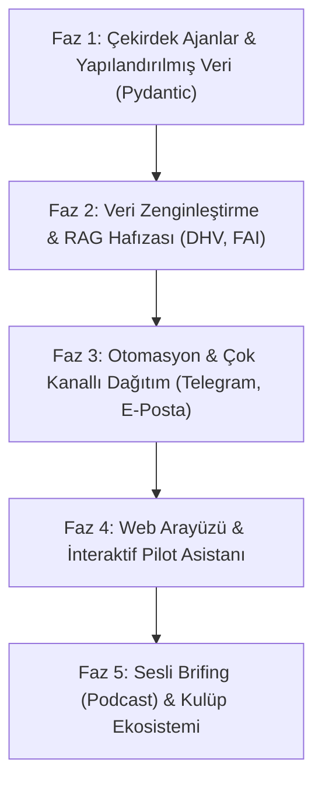

# 🪂 Paragliding News AI Agent — Stratejik Yol Haritası (Roadmap)

> **Kuzey Yıldızı (Vizyon):** Sadece basit bir RSS özetleyicisi değil; yamaç paraşütü dünyası, pilotlar, eğitmenler ve kulüpler için **"Otonom Yapay Zeka İstihbarat & Günlük Pilot Bülteni Platformu"** (Autonomous Paragliding Intelligence & Daily Digest Platform).

---

## 🗺️ Genel Görünüm



---

## 📍 1. Mevcut Durum Analizi (Neredeyiz?)

- [x] **Paket & Ortam Yönetimi**: `uv` ile deterministik Python 3.12/3.13 ortamı ve kütüphane yönetimi.
- [x] **Yerel LLM Entegrasyonu**: Ağdaki Llama/Gemma yerel sunucusu (`http://192.168.1.200:8080/v1`) ile bağlantı.
- [x] **Derin Makale Çıkarımı**:
  - `googlenewsdecoder` ile Google News şifreli/yönlendirmeli URL'lerinin asıl yayıncı adreslerine çözümlenmesi.
  - `curl_cffi` + `trafilatura` ve BeautifulSoup ile 403 engellerini aşıp tam makale metinlerinin (2.000 - 4.000 karakter) çıkarılması.
  - Paragliding Forum üzerinde `<span class="postbody">` hedeflemesiyle gerçek pilot tartışmalarının ayrıştırılması.
- [x] **Veri Kalıcılığı**: `news.json` ve `outputs/news.json` dosyalarına artımlı (incremental) ve güncellenebilir kayıt.

---

## 🚀 2. Aşamalı Yol Haritası (Phased Milestones)

### 🔹 FAZ 1: Çekirdek Ajan Mimarisi & Yapılandırılmış Veri
**Hedef:** Sistemin kendi içinde tam otonom, doğrulanabilir ve yapılandırılmış veri üreten 3 ajanlı bir ekibe dönüşmesi.

- [x] **Ajanların Tanımlanması:**
  - `news_scout`: Kaynakları tarar ve tam metinleri çıkarır (ParaglidingNewsFetchTool ile donatıldı).
  - `news_analyst`: Haberleri doğrular, mükerrerleri eler, güvenlik ve ekipman önem puanı verir.
  - `digest_editor`: Hem Markdown hem de bülten formatında çıktı üretir.
- [ ] **Pydantic Structured Output Entegrasyonu:**
  - `models.py` içindeki `ParaglidingNewsDigestJSON` şemasının CrewAI task çıktısına bağlanması (`output_pydantic`).
  - Web UI, veritabanı veya API servisleri için her zaman geçerli şemada JSON garantisi.
- [ ] **Context Window & Prompt Optimizasyonu:**
  - Yerel LLM'lerin context boyutuna göre (örn. 8k-16k) haberlerin önem derecesine göre önceliklendirilerek LLM'e iletilmesi.
- [ ] **Hibrit Model Desteği (Fallback):**
  - Yerel sunucu yanıt vermezse veya ağır yük altında kalırsa opsiyonel bulut API'sine (örn. Gemini API) geçiş fallback mekanizması.

---

### 🔹 FAZ 2: Veri Kaynaklarını Genişletme & Akıllı Hafıza (RAG)
**Hedef:** Dünyanın en saygın havacılık ve yamaç paraşütü otoritelerini kapsamak, geçmiş bültenleri hatırlamak.

- [ ] **Kritik Havacılık Kaynaklarının Eklenmesi:**
  - **DHV (Deutscher Hängegleiterverband):** Alman Emniyet Bültenleri (Safety Notices, harness/carabiner recalls).
  - **CIVL / FAI & PWCA:** Resmi yarışma skorları, kural değişiklikleri ve dünya rekorları.
  - **Oz Report / Paragliding.Earth:** Take-off (kalkış pisti) güncellemeleri ve uluslararası uçuş bültenleri.
  - **Türkiye / Yerel Kaynaklar:** THK duyuruları, yerel yarışmalar ve Türkiye kulüp bültenleri.
- [ ] **Vektör Veritabanı & Geçmiş Hafıza (ChromaDB / SQLite-vec):**
  - Haberlerin semantik vektör embedding'lerinin saklanması.
  - Aynı ekipman veya kaza hakkında daha önce çıkan haberleri tespit edip ilişkilendirme (örn. *"Bu harnes için 4 ay önce de toka kontrol uyarısı yayımlanmıştı"*).

---

### 🔹 FAZ 3: Otomasyon & Çok Kanallı Dağıtım
**Hedef:** Üretilen istihbaratı ve bülteni pilotların cebine doğrudan ulaştırmak.

- [ ] **Zamanlanmış Çalışma (Otomasyon):**
  - Windows Task Scheduler, Cron veya GitHub Actions ile her sabah (örn. 07:30) otomatik tarama ve bülten üretimi.
- [ ] **Telegram & Discord Botu:**
  - **Acil Güvenlik Uyarısı:** Kritik bir güvenlik bildirimi (kanat/harnes toka hatası vb.) tespit edildiğinde pilot grubuna anında acil push bildirimi.
  - **Günlük Sabah Bülteni:** Markdown formatında sabah özeti.
- [ ] **E-Posta & HTML Bülteni:**
  - Substack / Mailchimp veya doğrudan SMTP üzerinden şık bir HTML pilot bülteni gönderimi.
- [ ] **Terminolojiye Uygun Türkçe Yerelleştirme:**
  - Havacılık jargonuna sadık kalarak (*vol-bivouac*, *speedbar*, *asimetrik kapanma*, *termik*, *yedek atımı*) Türkçe dil seçeneği.

---

### 🔹 FAZ 4: Web Arayüzü & İnteraktif Pilot Asistanı
**Hedef:** Pilotların haberleri inceleyebileceği ve sorular sorabileceği modern bir dashboard.

- [ ] **Web Dashboard (FastAPI + Streamlit veya React/Tailwind):**
  - Kategori filtreleri: 🪂 Kanat & Ekipman, 🏆 Yarışmalar & Rekorlar, 🛡️ Güvenlik & Geri Çağırmalar, 🌄 XC & Macera.
  - Tarih aralığına ve anahtar kelimeye göre arama.
- [ ] **"Pilota Sor" (RAG Chatbot):**
  - Pilotların geçmiş veritabanıyla doğal dilde sohbet edebilmesi:
    - *"Bu ay EN-B sınıfında hangi yeni kanatlar çıktı?"*
    - *"Son 1 yılda reserve parachute (yedek) ile ilgili hangi bültenler yayımlandı?"*
- [ ] **XContest / Leonardo Entegrasyonu:**
  - Günün veya haftanın en dikkat çekici XC uçuşlarını otomatik çekip bültene ekleme.

---

### 🔹 FAZ 5: İleri Düzey Ekosistem & Ürünleşme
- [ ] **Sesli Pilot Brifingi (AI Audio / Podcast):**
  - Günlük bülteni Edge-TTS veya ElevenLabs ile 3-5 dakikalık bir *"Sabah Uçuş Brifingi"* ses dosyasına dönüştürme.
- [ ] **Uçuş Kulüpleri & Okulları için API / Widget:**
  - Uçuş okullarının kendi web sitelerine gömebilecekleri dinamik güvenlik ve haber widget'ı.

---

## 🛠️ Teknik Karar Noktaları & Tercihler

| Bileşen | Önerilen Tercih | Alternatif / Gelişim | Gerekçe |
| :--- | :--- | :--- | :--- |
| **Paket Yönetimi** | `uv` | Poetry / Pip | Hızlı, deterministik, `uv.lock` uyumlu |
| **LLM Motoru** | Yerel Llama Server / Gemma | Gemini 1.5/2.5 / OpenAI API | Veri gizliliği, maliyetsiz yerel çıkarım, gerektiğinde hibrit geçiş |
| **Web Çıkarımı** | `curl_cffi` + `trafilatura` | Playwright / Selenium | Hafif, hızlı, Cloudflare/403 atlatma özellikli |
| **URL Çözücü** | `googlenewsdecoder` | Standart Requests | Google News şifreli yönlendirmelerini doğrudan kaynağa çözer |
| **Hafıza / Veri** | JSON + SQLite / ChromaDB | PostgreSQL + pgvector | Kolay kurulum, taşınabilir yerel dosya tabanlı veritabanı |
| **Dağıtım** | Telegram Bot API | Discord Webhook / Email | Pilotların arazide en hızlı ulaştığı kanal |

---

## ⚡ Hızlı Başlangıç Komutları

```bash
# Bağımlılıkları senkronize et
uv sync

# Standart günlük taramayı çalıştır
uv run python main.py

# Belirli bir konuyu derinlemesine tara
uv run python main.py --topic "safety gear recalls"
uv run python main.py --topic "X-Alps competitions"

# RSS ve çıkarma aracını doğrudan test et
uv run python test_tools.py
```
